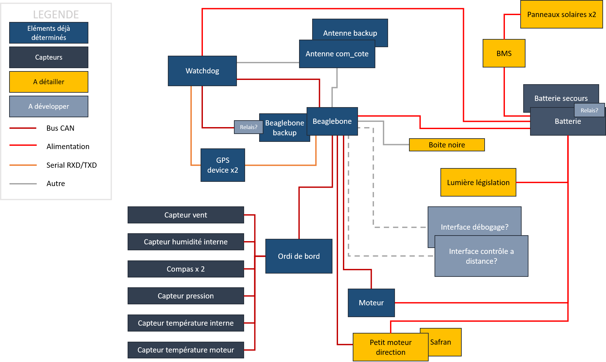

# Architecture
Ceci est une ébauche de l'architecture finale des systèmes embarqués du bateau.

Cette présentation de l'architecture est amenée à évoluer en fonction des besoins du projet.

> **Note :** Les protocoles de communications entre les différents composants ne sont pas représentatifs de la réalité puisque le choix des composants n'est pas définitif à ce stade.

# Composants

## Ordinateur de bord

Considérant que notre bateau autonomme puisse être apparenté à un drone, nous avons fait le choix d'utiliser un <i>flight controller</i> comme ordinateur de bord. C'est pourquoi nous utilisons au sein de notre architecture de navigation un <i>BeagleBone Blue</i> choisit pour sa compatibilité avec .

Vous trouverez plus d'information sur le *BeagleBone Blue* sur [la page dédiée](wiki/BeagleBone-Blue) dans le wiki du projet.